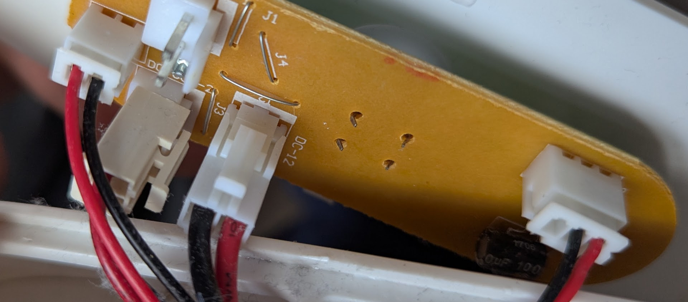
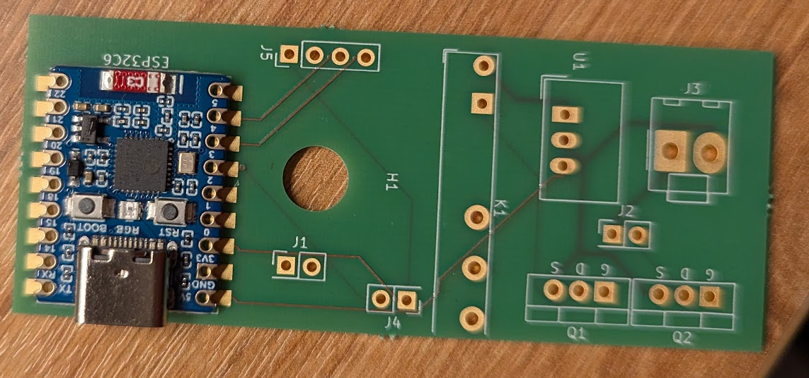
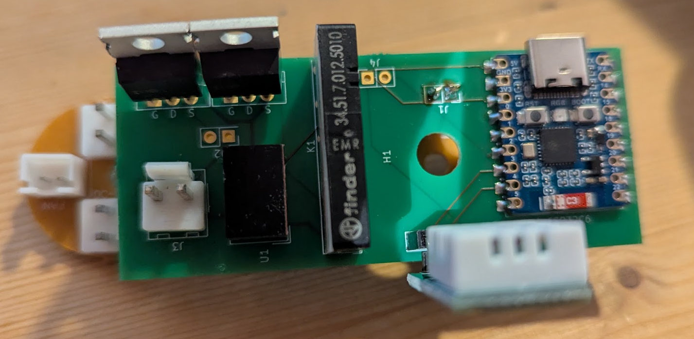
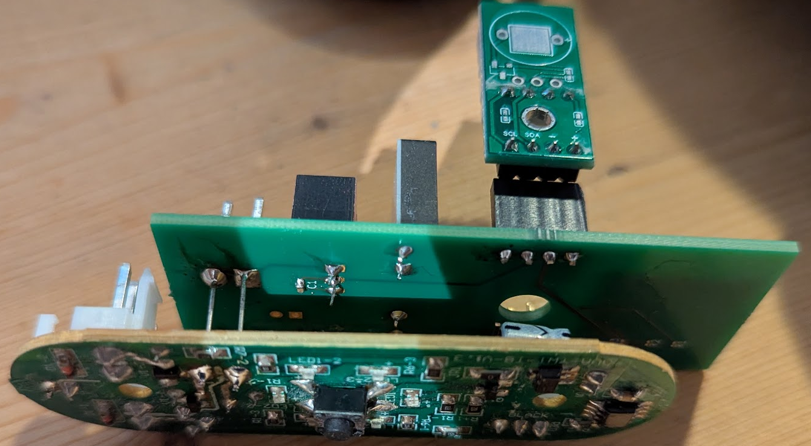
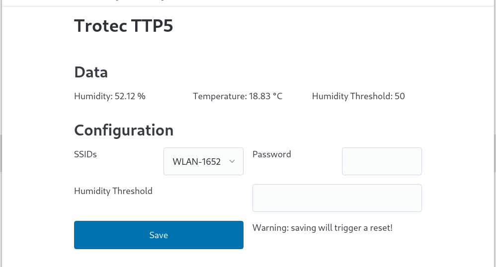

# Trotec TTP5 Dehumidifier

I bought a used Troted TTP5, which is a peltier based dehumidifier. It is absolutely sufficient for small rooms like my bathroom. But it only has two modes: On and Off. The original PCB looks like this:

The 9 Volt input power is connected to the "DC-12" port. Peltier and Fan are connected in the left of this image. The connector on the right is the "water level high" switch. In this model it is literally a switch which is turned on by a high water level. 

My idea is to take the "water level high" signal input and "reuse" it as the enable or disable of the dehumidifier. So when turned on the dehumidifier will no longer be on, it will only be used if the humidity sensor shows a value below the threshold. 
The TTP5 PCB will act like the watertank is full, in case of low humidity or watertank full.

I designed the PCB in a way that it is piggybacked by the normal PCB:

The "water level high" signal is now handled by the added PCB.

After a testphase I connected the humidity sensor inside of the TTP5 chassis. 

The configuration Webinterface is very rudimental, but it does the job.

# To Do's

- Display the waterlevel status on webpage.
- Display the current status (peltier and fan On or Off).
- Add MQTT protocol and support.
- Add a small pump and connect it to the sewer pipe.